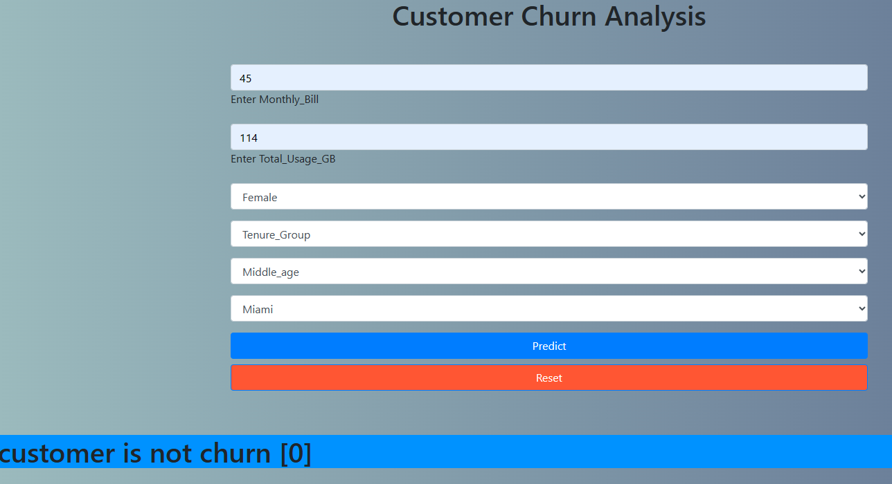

##  Sunbasedata Customer Churn Analysis

Customer churn is the percentage of customers that stopped using your company's product or service during a certain time frame. Preventing customer churn is critically important to the telecommunications sector, as the barriers to entry for switching services are so low.

Customer churn is when a company’s customers stop doing business with that company. Businesses are very keen on measuring churn because keeping an existing customer is far less expensive than acquiring a new customer. New business involves working leads through a sales funnel, using marketing and sales budgets to gain additional customers. Existing customers will often have a higher volume of service consumption and can generate additional customer referrals..

### Aim of the this Project

Develop a machine learning model to predict customer churn based on historical customer data. You will follow a typical machine learning project pipeline, from data preprocessing to model deployment.

Aim of building and comparing several customer churn prediction models.

Customer churn is when a company’s customers stop doing business with that company.It is categorical data. It consists of Yes and No. Hence here we would be using binary classifications. Yes means they have stopped and No means they continue with company.

Target:

Churn — Whether the customer churned or not (Yes, No)

### Dataset Description

You are provided with a dataset containing historical customer information, including customer attributes, interactions, and whether they churned or not. The dataset is in CSV format.

### Software and Tools Requirements

1. [GithubAccount](https://github.com)

2. [GitCLI](https://git-scm.com/docs/gitcli)

3. [VsCodeIDE](https://code.visualstudio.com)

4. [HerokuAccount](https://Heroku.com)

### Create a new Envirnment

.....

conda create  -p  env python==3.9 -y

.....

### Install all librabries

1. Pandas
2. numpy
3. Flask
4. sklearn
5. unicorn
6. matplotlib
7. seaborn

### Push All files into github
by using git commands
git status
git commit
git add
git push

### Exploratory data analysis
Exploratory data analysis (EDA) is used by data scientists to analyze and investigate data sets and summarize their main characteristics, often employing data visualization methods.

1. loading data sets
2. find out shape of the data There are 28 number of features so we have to know each and every features very well so that we can drop the feature which are not usefull in prediction. 
3. Total null value present in dataset.
4. check datatypes and memory captured.
5.  Check unique values present in each Column.
6. check the value count of each column to see if there are any unexpected and unwanted entries present in the column.

### Feature Engineeering

1. Delete unwanted or unexpected value from each feature.
2. Create New Columns from existing variables that is useful for model building and prediction like
      "Age Group ","Tenure_ group"
4. convert into Date-Time columns.

### Data Cleaning

1. Drop all those unnecessary columns with all the null values and will not require in further analysis
2. Dropping the null rows from dataset, as they will be having unique entries only.
6. Adding new updated columns

### Visualization 

1. Pie Chart
Findout how much percent customer is churn or not
  0- not churn
  1- churn
2. Count plot for categorical type of variables
4. Box plot for finding outliers.
5. Density plot for checking skewness.
6. Correlation for finding relationship between target variable with independent features.

### Data Preprocessing
1. Remove outliers by using z-score.
2. remove skewness by using PowerTransformer.
3. Label encoding for changing all categorical value into numeric value.
4. Feature and Label Selection
5. Univariate Selection of each features by using SelectKBest.
6. Principle Component Analysis by using PCA.
7. Balancing the target dataset using Oversampling by using smote.
8. Scaling using Standard Scaler.

##  Model Building

### Classification Model
 1.We use classification algorithm for obtaining the customer churn or not
2. Train test split for dividing data into  70% train and 30% test purpose.
3. finding best random state.

 That is a list of Classification algorithm that is used for model building is
1. LogisticRegression()
2. RandomForestClassifier()
3. KNeighborsClassifier()
4. DecisionTreeClassifier()
5. AdaBoostClassifier()
6. GradientBoostingClassifier()
7. KNeighborsClassifier()

Find out the accuracy of each model and compare  all the models according to its performance like-
1. Accuracy score, 
2. log loss,
3. Cross Validation ,
4. Auc score ,
5. confusion matrix 

### Hyperparameter tunning

Looking at all the Scores, I have selected Random Forest as a best model because different between Accuracy score and CVS is minimum and use RandomizedSearchCv for hyperparameter tunning.

###  Saving ,Loading and Prediction of the best Classification ML model

Save and load model into  the binary file by using pickle libraries dumb and load function.
Predict the saved model by using test data.

### Deployment 

1. app.py
 create aap .py file  by using Flask API in which I put condition like if our model1 value is 0 the customer is not churn and model1 value is 1 then customer is churn.
2. home.html is used for frontend .

